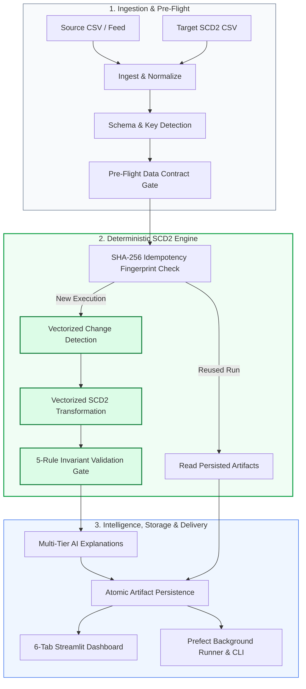

<div align="center">

# SCD2 Copilot
### AI-Assisted Data Change & Historical Analytics Platform

[](https://python.org)
[](https://pola.rs)
[](https://prefect.io)
[](https://docs.pydantic.dev)
[](https://streamlit.io)
[](https://pytest.org)
[](LICENSE)

<p align="center">
  <strong>Deterministic Correctness · High-Throughput Vectorization · Multi-Tier AI Explanation · Prefect Orchestration</strong>
</p>

</div>

---

## 📖 Overview & Philosophy

**SCD2 Copilot** is a production-grade data change intelligence platform that automates **Slowly Changing Dimension Type 2 (SCD2)** ingestion, change classification, historical transformation, invariant validation, and plain-language GenAI explanations.

The platform is engineered around one core foundational principle:

> **The engine decides. Validation protects. AI explains.**

* **Deterministic Correctness**: All business-key matching, record classification (`NEW`, `CHANGED`, `UNCHANGED`, `DELETED`), version creation, effective date assignments, and idempotency checks are performed using 100% deterministic vectorized Polars relational operations. The LLM **never** makes data transformation decisions.
* **Validation Protection**: A formal 5-rule mathematical invariant validation gate inspects the output table. Any violation fails the pipeline and prevents corrupt historical versions from being committed or consumed.
* **Grounded AI Explanations**: Generative AI (Google Gemini with Groq and deterministic template fallbacks) receives only validated aggregate summaries and change sets to produce clear business narratives, complete with token, latency, and cost tracking.
* **Strict Separation of Concerns**: Data quality and SCD2 correctness are 100% authoritative and completely orthogonal to AI explanation status. An LLM outage or fallback never alters or invalidates SCD2 historical data.

---

## 🏛 System Architecture

The end-to-end execution pipeline operates as a directed acyclic workflow orchestrated via **Prefect 3**:



### Main Pipeline Stages

1. **Ingestion & Normalization** ([`src/scd2_copilot/ingestion.py`](src/scd2_copilot/ingestion.py)):
   - Ingests incoming snapshot and historical SCD2 CSV feeds into Polars DataFrames with schema inference.
   - Cleanses headers (lowercased, whitespace-trimmed) and normalizes temporal columns (`effective_from`, `effective_to`) to ISO calendar dates (`pl.Date`).
2. **Schema & Business Key Detection** ([`src/scd2_copilot/schema.py`](src/scd2_copilot/schema.py)):
   - Supports explicit user-configured business keys or applies heuristic uniqueness detection to identify single or composite business keys.
   - Dynamically identifies tracked dimensional attributes that participate in change detection.
3. **Pre-Flight Data Contract Gate** ([`src/scd2_copilot/contracts.py`](src/scd2_copilot/contracts.py)):
   - Validates incoming schema completeness, temporal types, and key constraints.
   - Preemptively halts execution and rejects duplicate keys with `DuplicateBusinessKeyError` before data processing begins.
4. **Deterministic Change Detection** ([`src/scd2_copilot/detect_changes.py`](src/scd2_copilot/detect_changes.py)):
   - Executes a native Polars `validate="m:1"` **`LEFT JOIN`** between incoming source and current target rows (`is_current == True`).
   - Uses vectorized null-safe `.ne_missing()` comparisons across tracked columns with empty-string/whitespace normalization to classify records into `NEW`, `CHANGED`, or `UNCHANGED`.
   - Executes an **`ANTI JOIN`** to detect deletions when absence is meaningful (`SnapshotMode.FULL` + `DeletePolicy.SOFT_DELETE`).
5. **Vectorized SCD2 Transformation** ([`src/scd2_copilot/transform_scd2.py`](src/scd2_copilot/transform_scd2.py)):
   - Implements **half-open temporal interval semantics `[effective_from, effective_to)`**.
   - Assembles the updated table via a 4-partition projection, filter, and union pipeline (`historical`, `retained_active`, `closed`, `new_active`) with **zero Python row loops**.
6. **Authoritative Invariant Validation** ([`src/scd2_copilot/validate.py`](src/scd2_copilot/validate.py)):
   - Evaluates the 5 non-negotiable SCD2 mathematical invariants. Produces an authoritative `ValidationReport` gating downstream delivery.
7. **Multi-Tier AI Explanations** ([`src/scd2_copilot/explain.py`](src/scd2_copilot/explain.py)):
   - Converts validated change records into structured Pydantic models and passes them to resilient LLM providers to produce business-friendly narratives.
8. **Durable Artifact Persistence** ([`src/scd2_copilot/artifacts.py`](src/scd2_copilot/artifacts.py)):
   - Atomically writes Parquet tables, JSON audit reports, and SHA-256 execution fingerprint links to disk under `data/runs/<run_id>/`.

---

## ⚖️ Temporal & Snapshot Semantics

### Half-Open Interval Convention `[effective_from, effective_to)`
- `effective_from`: **Inclusive**
- `effective_to`: **Exclusive** (`None` indicates the open-ended current version)

```text
Version A: [2026-09-01, 2026-09-06)  --> Active from Sept 1 00:00 through Sept 5 23:59:59
Version B: [2026-09-06, NULL)        --> Active from Sept 6 00:00 onward
```

Point-in-time lookup queries for any date $T$ use strict non-overlapping boundary conditions:
```sql
effective_from <= T AND (effective_to > T OR effective_to IS NULL)
```

> **Note**: Standard `BETWEEN` is intentionally avoided because it is inclusive on both ends, which would produce duplicate version matches on boundary dates.

### Snapshot Mode vs. Deletion Policy Decision Matrix

The platform strictly decouples snapshot semantics (*"Is absence meaningful?"*) from deletion policy (*"What should happen when absence is meaningful?"*):

| `snapshot_mode` | `delete_policy` | Meaning of Missing Active Target Key | Resulting Target Active Version |
| :--- | :--- | :--- | :--- |
| **`full`** *(default)* | **`soft_delete`** *(default)* | Record was deleted from universe | Closed (`effective_to = processing_date`, `is_current = False`) |
| **`full`** | **`ignore`** | Deletions not modeled | Retained active (`effective_to = None`, `is_current = True`) |
| **`incremental`** | **`soft_delete`** | Record unchanged in this delta batch | Retained active (`effective_to = None`, `is_current = True`) |
| **`incremental`** | **`ignore`** | Record unchanged in this delta batch | Retained active (`effective_to = None`, `is_current = True`) |

---

## 🛡 Formal SCD2 Validation Invariants

Every SCD2 table generated by the engine must strictly satisfy the 5 mathematical invariants in [`validate.py`](src/scd2_copilot/validate.py):

| Invariant Rule | Mathematical / Logical Requirement | Implementation Enforcement |
| :--- | :--- | :--- |
| **1. `schema_completeness`** | Tracking columns (`effective_from`, `effective_to`, `is_current`) must exist and adhere to valid types (`pl.Date`, `pl.Boolean`). | Gated before version inspection |
| **2. `one_current_per_key`** | For each business key, at most one version may have `is_current == True`. | Vectorized key grouping & current flag sum |
| **3. `no_null_keys`** | Business key columns must contain zero `NULL` or whitespace-only blank values. | Null count assertion across key columns |
| **4. `no_overlapping_dates`** | Chronologically adjacent versions must satisfy `next.effective_from >= prev.effective_to`. Overlaps strictly fail; chronological gaps are preserved. | Window lag comparison on ordered intervals |
| **5. `date_consistency`** | Closed rows must satisfy `effective_from < effective_to` (no zero-duration or inverted dates). Active rows must have `effective_to IS NULL`; closed rows must have `effective_to IS NOT NULL`. | Columnar expression check across all rows |

---

## ⚡ High-Performance Vectorized Engine

The engine is built on **Polars** with multi-engine support (`auto`, `in-memory`, and `streaming`):

| Dataset Size | Business Key | Engine | Detect Time | Apply Time | Val Time | Total Pipeline Time | Engine Throughput |
| :--- | :--- | :--- | :--- | :--- | :--- | :--- | :--- |
| **10,000 rows** | Single | auto | 0.138s | **0.005s** | 0.023s | **0.143s** | **69,760 rows/sec** |
| **100,000 rows** | Single | auto | 1.785s | **0.012s** | 0.183s | **1.797s** | **55,623 rows/sec** |
| **500,000 rows** | Single | auto | 12.92s | **0.057s** | 1.817s | **12.98s** | **38,519 rows/sec** |
| **1,000,000 rows** | Single | auto | 34.22s | **0.130s** | 4.111s | **34.35s** | **29,111 rows/sec** |
| **100,000 rows** | Composite | auto | 2.815s | **0.051s** | 0.257s | **2.866s** | **34,887 rows/sec** |

* Benchmarked on AMD64 Intel i7 / 12 logical cores / 16 GB RAM.
* **53x to 290x faster** than row-iteration loops with **99.9% heap memory reduction** (0.01 MB transformation heap).

---

## 🤖 Multi-Tier AI Explanation Architecture

GenAI explanations translate technical database changes into human-readable business narratives without affecting data quality or pipeline execution:


* **Intelligent Error Classifier**: Detects HTTP 429 daily quota exhaustion (`GenerateRequestsPerDayPerProjectPerModel-FreeTier`) and advances to fallback models immediately without wasting time on futile retries.
* **Transient Error Backoff**: Employs exponential backoff (3s, 6s) for recoverable transient rate limits (`MAX_RETRIES = 2`).
* **Precise Cost Accounting**: Integrates an authoritative Google Gemini pricing registry to track input/output token costs down to the micro-cent.
* **Zero-Warning AFC Configuration**: Explicitly configures client settings to avoid Automatic Function Calling warnings during structured schema generation.

---

## 🚀 Orchestration, Idempotency & Persistence

### 1. Prefect 3 Automation
- Pipeline tasks are decorated with Prefect `@flow` and `@task` primitives.
- Includes a dedicated background runner ([`src/scd2_copilot/deployment.py`](src/scd2_copilot/deployment.py)) serving the `scd2_pipeline/local-processing` deployment.
- Auto-spawns and manages a shared dedicated Prefect server on `http://127.0.0.1:4200/api` with safe port detection.

### 2. SHA-256 Execution Fingerprinting & Idempotency
- Every pipeline execution computes a cryptographic fingerprint from source and target data digests, business keys, tracked columns, snapshot mode, and delete policy.
- Identical batch re-runs automatically **short-circuit the engine**: persisted artifacts are loaded directly with **zero recomputation**.

### 3. Durable Storage Structure
```text
data/runs/
├── .fingerprints/
│   └── a3a49f9f...json           # Fingerprint index pointing to completed run ID
└── run_20260909_230816_dc522464/
    ├── metadata.json             # Run metadata, parameters, row counts, timings
    ├── scd2_output.parquet       # Columnar updated SCD2 historical dataset (zstd)
    ├── changes.json              # Detailed classification audit log & field diffs
    ├── validation.json           # 5-rule invariant checklist results & rule details
    └── explanations.json         # AI business narratives & token cost breakdown
```

---

## 🖥 Streamlit Analytics Dashboard

The platform features a modern, dark-themed **Streamlit** dashboard ([`app/streamlit_app.py`](app/streamlit_app.py)) with an intuitive storytelling flow:

```text
Upload CSVs or ⚡ Try Sample Data
        ↓
Configure Match Keys & Tracked Change Fields
        ↓
[ Analyze Changes ]  (Collapsible Advanced Settings)
        ↓
Hero Banner (Status + Change KPIs + Executive "What Happened?" Narrative)
        ↓
6 Focused Result Tabs:
[Overview] [What Changed?] [Why It Changed (AI)] [SCD2 Validation] [Updated SCD2 Table] [History]
```

* **⚡ Try Sample Data**: One-click onboarding to load synthetic customer test datasets without searching for CSVs.
* **Hero Summary Card**: Instant analysis status, KPI metrics (`NEW`, `CHANGED`, `UNCHANGED`, `DELETED`), and an executive plain-language takeaway.
* **Tab 1: Overview**: Visual breakdown grid, throughput (rows/s), processing duration, invariant scorecard, and strict separation disclaimers.
* **Tab 2: What Changed?**: Side-by-side Old → New comparison diff table, new records preview, deleted records preview, and raw data inspect.
* **Tab 3: Why It Changed (AI)**: Natural language business explanations grouped by change type, with secondary AI usage, token efficiency, and cost telemetry.
* **Tab 4: SCD2 Validation**: Complete 5-rule mathematical invariant pass/fail status with expandable diagnostic details for auditing.
* **Tab 5: Updated SCD2 Table**: Searchable, filterable view of active vs historical versions with total row and version count stats.
* **Tab 6: History**: Canonical timeline of prior executions directly from `data/runs/` with one-click historical run loading.
* **Exports Panel**: One-click exports for SCD2 Output (CSV), Validation Report (TXT), and Explanations (TXT).

---

## 📁 Repository Structure

```text
.
├── .agents/                    # Agent rules & skills (Graphify, Streamlit, Audit)
├── app/                        # Streamlit Web Application
│   ├── dashboard_theme.css     # Dark surface design tokens & typography
│   ├── streamlit_app.py        # Main dashboard UI & execution handler
│   └── ui_components.py        # Reusable UI cards, tabs, diff tables & KPI strips
├── data/                       # Data storage directory
│   └── runs/                   # Persisted run artifacts & SHA-256 fingerprints
├── docs/                       # Project documentation & contracts
├── graphify-out/               # Graphify knowledge graph index (gitignored)
│   ├── graph.json              # Repository dependency graph
│   ├── GRAPH_REPORT.md         # Architecture & community report
│   └── graph.html              # Interactive browser visualization
├── sample-data/                # Synthetic customer & transactional test CSVs
├── src/
│   └── scd2_copilot/           # Core Platform Engine
│       ├── artifacts.py        # Parquet/JSON artifact persistence & idempotency
│       ├── config.py           # Typed settings & Gemini model pricing registry
│       ├── contracts.py        # Pre-flight data contracts & duplicate key gate
│       ├── deployment.py       # Prefect runner, API configuration & polling
│       ├── detect_changes.py   # Vectorized change detection engine
│       ├── exceptions.py       # Domain-specific error hierarchy
│       ├── explain.py          # AI explanation orchestrator & metrics
│       ├── failure.py          # Structured error categorization
│       ├── ingestion.py        # CSV parsing, date normalization & schema checks
│       ├── models.py           # Typed Pydantic data models & change records
│       ├── schema.py           # Heuristic & explicit business key detection
│       ├── transform_scd2.py   # High-speed vectorized SCD2 transformation
│       ├── validate.py         # 5-rule SCD2 invariant validation gate
│       ├── workflow.py         # Prefect 3 flow & task DAG orchestration
│       └── providers/          # LLM Provider implementations
│           ├── base.py         # Abstract provider interface
│           ├── gemini.py       # Google GenAI provider with fallback routing
│           ├── groq.py         # Groq secondary fallback provider
│           └── template.py     # Deterministic zero-cost template provider
├── tests/                      # Comprehensive Pytest suite (440 passing tests)
│   ├── adversarial/            # Stress tests, profilers & benchmarks
│   ├── conftest.py             # Shared fixtures, temporary runners & datasets
│   ├── test_detect_changes.py  # Change classification tests
│   ├── test_gemini_config.py   # AI fallback routing & retry tests
│   ├── test_idempotency.py     # SHA-256 fingerprinting & short-circuit tests
│   ├── test_prefect_*.py       # Orchestration, scheduling & deployment tests
│   ├── test_run_artifacts.py   # Parquet/JSON persistence & readback tests
│   ├── test_transform_scd2.py  # SCD2 transformation logic tests
│   └── test_validate.py        # Invariant rule verification tests
├── AGENTS.md                   # Formal agent development contract & specifications
├── pyproject.toml              # Project metadata & build configuration
├── pytest.ini                  # Pytest configuration & markers
└── requirements.txt            # Python dependencies
```

---

## ⚡ Quickstart & Installation

### Prerequisites
- **Python 3.12** (or 3.10+)
- **uv** (recommended for ultra-fast dependency management) or **pip**

### 1. Clone & Setup Environment
```powershell
# Clone repository
git clone https://github.com/HarishKumar-005/Project---sdc2-copilot.git
cd "Project - sdc2-copilot"

# Create virtual environment with uv
uv venv .venv
.venv\Scripts\activate

# Install dependencies
uv pip install -r requirements.txt
```

### 2. Configure Environment Variables
Copy `.env.example` to `.env` and configure your API keys:
```env
# Primary LLM Provider: Google Gemini
GEMINI_API_KEY=your_gemini_api_key_here

# Optional Fallback: Groq
GROQ_API_KEY=your_groq_api_key_here

# Default Provider: gemini | groq | template
LLM_PROVIDER=gemini

# Primary & Fallback Models
GEMINI_MODEL=gemini-3.8-flash
GEMINI_FALLBACK_MODELS=gemini-3.5-flash-lite,gemini-3.1-flash-lite,gemini-2.5-flash

# Prefect Server API Endpoint
PREFECT_API_URL=http://127.0.0.1:4200/api
```

### 3. Launch the Streamlit Dashboard
```powershell
uv run streamlit run app/streamlit_app.py
```
Open your browser at `http://localhost:8501`. Click **"⚡ Try Sample Data"** and then **"Analyze Changes"** for an instant end-to-end demo!

---

## ⚙️ Running with Prefect Background Deployment

To run pipelines headless via the background Prefect runner:

### Terminal 1: Start the Background Runner
```powershell
uv run python -m src.scd2_copilot.deployment --serve
```
*Starts a dedicated Prefect server on `http://127.0.0.1:4200` and begins serving `scd2_pipeline/local-processing`.*

### Terminal 2: Trigger a Run via CLI
```powershell
uv run python -m src.scd2_copilot.deployment --trigger `
    --source sample-data/source_today.csv `
    --target sample-data/target_yesterday.csv `
    --date 2026-09-09
```

Alternatively, select **"Prefect Deployment (Background Runner)"** in the Streamlit UI and click **"Analyze Changes"**. Streamlit polls execution live (`Scheduled` → `Running` → `Completed`) and renders the full results dashboard automatically upon completion.

---

## 🧪 Testing & Verification

The repository enforces 100% deterministic test coverage across **440 unit, integration, and orchestration tests**:

```powershell
# Run the complete test suite (excluding long-running benchmarks)
uv run pytest -m "not benchmark" -q

# Run SCD2 transformation & invariant validation tests
uv run pytest tests/test_transform_scd2.py tests/test_validate.py

# Run Prefect orchestration & background deployment tests
uv run pytest tests/test_prefect_deployment.py tests/test_prefect_orchestration.py

# Run AI fallback routing & retry tests
uv run pytest tests/test_gemini_config.py
```

---

## 🔍 Codebase Navigation with Graphify

The project includes an integrated **Graphify** knowledge graph index:

```powershell
# Trace shortest call paths between symbols
graphify path "run_pipeline" "apply_scd2"

# Inspect any symbol, source line, and its callers
graphify explain "validate_scd2"

# Query the codebase architecture using natural language
graphify query "how are deployment artifacts loaded"

# Update graph after file edits (local AST, zero API cost)
graphify update .
```

---

## 📄 License

This project is licensed under the Apache 2.0 License.
